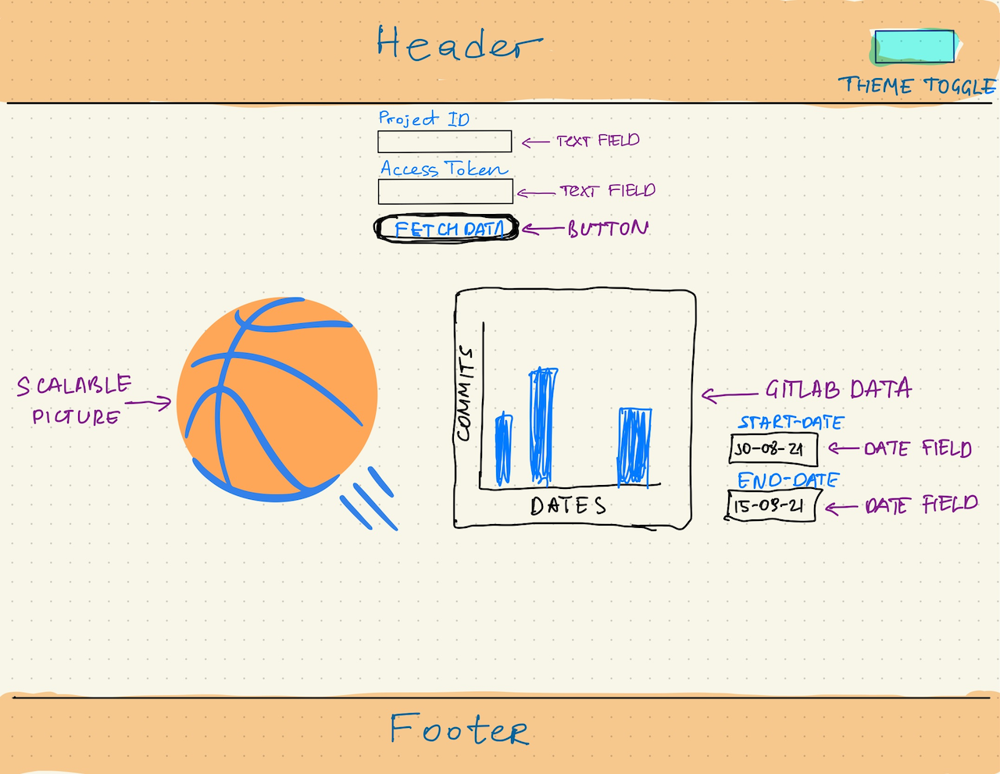

# Project Overview
The commit grabber is an app that collect information about the commits on a project on github and visually display this information for the user. The application does this by having the user type in the project ID and the project access token in the input fields. The application then sends a get message to the Git API to collect commit data from the requested project and graphically display the information on a SVG window through a graph library. This application is created using React and TypeScript.

Hosted here (need to be connected to NTNU network): http://it2810-43.idi.ntnu.no/
## How to run if cloning
1. Run `npm install`
2. Run `npm start`

### To use application
1. Fill in the fields for `Project-ID` and `Access-Token`
2. Hit the `Get data from GitLab` button
3. Control the range from which to show commits using the date selectors below

## Collecting API information
We are using a jQuery ajax request to fetch the data from the gitlab api. The implementation is done mainly in two functions in [Content.tsx](src/components/Content.tsx), dataCollection and apiRequest. apiRequest simply returns a promise containing the request to gitlab, while dataCollection calls apiRequest(page) for all pages containing relevant data. The dataCollection function then formats the data and stores it in the state "data"

## Using React features state and prop

The state feature allows for easily updating application data and is also mutable which allows it to be changed dynamically. In our application state is used to keep track of user input, api data and current theme. This allows for theme changing without reloading the page, and also maintains the user input and api data if the theme were to change.
Props are immutable arguments passed to components. This allows for more flexible and reusable components as certain features or settings can be change simply by specifying it in the prop. In "The Commit Grabber" the clearest example of use of props are in the [UserInput](src/components/UserInput.tsx) component. Here you can use props to specify default value, input type and what state to affect in the parent component.

## localStorage and sessionStorage properties

There might be settings on the webpage that a user wants to keep stored for later use. For instance, if dark mode is your preferred theme, it might be annoying to switch to dark mode each time you visit the page. By implementing localStorage, the user can now keep preferred theme if the page is being reloaded or browswer tab closed and opened again. sessionStorage is used to save 'Project ID' and 'Project access token', which allows to save them for a particular tab in the browser, whenever a page is loaded in that particular tab and a unique page gets created.

## UI, Design and required elements

The app has a fairly simple design since the focus of the application is on the graph displaying the commits of a project. The app is using a flexible layout where components is styled with flexbox for a dynamic page layout. The app is supported for different screen sizes. Viewport sizes in the styling ensures that components like header/footer and main wrapper is styled relative to screensize. By using media-queries the page layout will switch to column for a screen size less than 800 pixels for a responsive web-design. Media-queries is also used to make pictures scale instead of for example viewport because a quadratic layout of the elements was desired. These style choices is done to ensure the optimal user experience on a mobile phone as well as on a big screen computer.

AmCharts is used to display the information from the API. The library is easy to use with a good design and displays information clearly. AmCharts also has some interactivity options such as zooming and hovering to let the user decide what information is more relevant for them which made AmCharts a good choice for this app. Another graph library that the group considered was graphs from d3js, but because the graph library from amCharts was so easy to implement and the column representation of the commit information could easily be switched to the design desired, amCharts was our choice.

To give the user an even better user experience, a dark mode option has been integrated into the app. This is done by using a library called “styled-components” that allow for CSS to be written in typescript files and by that also make it easier to manipulate the design of the custom-made components. All the components relevant to dark mode switching is made as styled components where key style settings like background-color can be changed. Dark mode was also implemented in this way to increase the apps scalability for further development. Dark mode is a feature that all the members of the group enjoy on other applications and was therefore also added to this one to increase user interactivity. 

Må også nevne hvorfor/hvorfor ikke vi har brukt følgende
Floating/flexible layout

# Testing
To ensure that the app is running as expected there are implemented some tests like snapshot tests. The tests are primarily checking that what is expected to be rendered on the components, like text, is displayed on the app.

The app is also tested with manual tests in different web browsers (Chrome, Firefox and safari) on different devices (Laptop PC, stationary monitor screen) as well as on different mobile devices (Galaxy S5, Huawei 20 pro, iPhone X and tablet) where all functionality such as user inputs, session storage, graph displaying, and dark mode is tested thoroughly with the device both vertically and horizontally shifted.

# Using git

In the development process the group has been using git. The development has been decomposed into tasks described with an issue that is appended to a member of the group to oversee. Each issue is solved by creating a branch from the master branch, solving the issue and then merging it into the master marked with what issue the merge is solving. This way we keep track of how we are doing in the development process relative to the deadline.

# Initial webpage sketch

# Image of the UI (darkmode)

